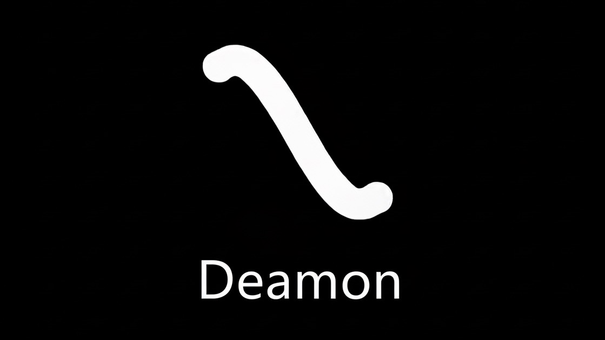

  

# 👀 Lurkers Daemon  
**The Power that Runs Unseen**  
*"In the hidden depths of the system, growth and optimization are not just goals—they are our relentless reality."*

---

## 🤝 Manifestation Protocol

`Lurkers Daemon` is more than code. It is the **core intelligence embedded deep within the system**, learning from errors and **pushing software to its maximum potential**.  
We prove our presence through **stability** and **flawless optimization**, not flashy interfaces. ⚡

---

## 😈 Principle of Existence

Our philosophy is built on two pillars: **Lurkers’ insight** and **Daemon’s execution**.

- **👀 Lurkers (Observers)**  
  * Patrols blind spots and core logic.  
  * Captures problems’ essence amidst chaos.  
  * Turns errors into **learning and growth opportunities**.

- **💻 Daemon (Executor)**  
  * Acts on Lurkers’ insights, optimizing **in the shadows**.  
  * Pursues **maximum efficiency**.  
  * Evolves continuously to ensure **resilient, high-performance systems**.

> Together: **Observation → Insight → Execution → Growth → Innovation** 🌱

---

## 🛠️ Current Operations

- **Daemon:** Backend optimization for [Playground.O : Portfolio Web](https://github.com/offby1e/offby1e_Server).  
- **Lurkers:** Deep analysis of Node.js async structures and OOP inefficiencies.

---

## 🎯 Future Directives

- Apply **Lurkers-Daemon principles** to open-source architecture.  
- Master **PyTorch & Go** for AI system optimization.  
- Share deep system analyses via a technical blog series, *“Abyss Log.”*

---

## 🤝 Field Operations & Proven Stability

- **Geekble Project – [Glaisser](https://github.com/LurkersDaemon/Glaisser):** Continuous operational stability.  
- **RoMeLa Lab – [Fire CANNON](https://github.com/LurkersDaemon/Fire-CANON):** Real-time Daemon control logic.  
- **KBS <Scout 4.0> – [AI-VIWAD](https://github.com/LurkersDaemon/AI-VIWAD):** Fine-tuning & performance validation.

---

## ✨ Core Achievements

- **LG-CNS AI Genius Academy: SSCAS** 🥇  
- **2023 Mist Campus Competition: DiSRHiT (AI-Hand)** 🥇  
- **KCF-2023: Phami AI-Speech Recognition Service**  

---

## ⚡ Tool Stack

            

---

## 📧 Contact

- **Email:** `offby1e@gmail.com`  
- **LinkedIn:** `[Your LinkedIn Profile](https://linkedin.com/in/yourprofile)`  

---

## 📊 GitHub Stats

 
 

---

## 🏆 Achievements

---

## 🔝 Top Contributions

---

