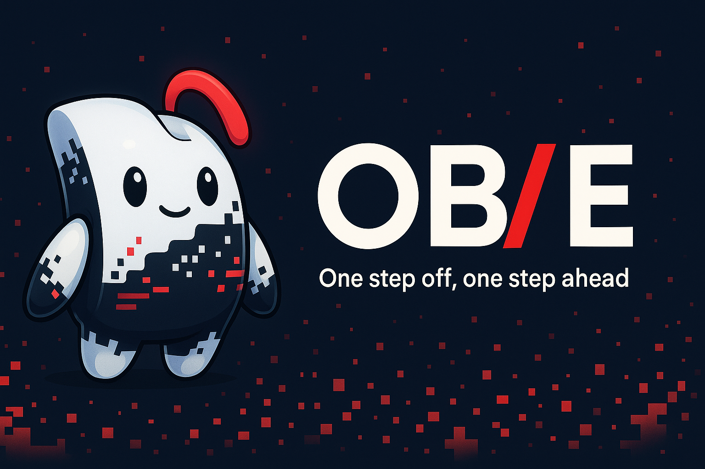

<!--  -->

  

## 🚀 About Me

I'm a passionate software engineer focusing on AI and Web Development. I love building innovative solutions and connecting with other developers.

## 🫧 OB/E — “One step off, one step ahead.”

OB/E is a brand inspired by the classic programming hiccup: the off-by-one error. That tiny one-step difference — just a single misplaced line — sparks a creative twist that lets us see the world differently. It’s a reminder that perfection isn’t everything, and sometimes stepping just slightly off the beaten path is what makes us truly unique and opens up new possibilities.

We don’t fear mistakes or differences — we embrace and celebrate them. From these so-called “errors,” we find new ideas and opportunities. OB/E represents the spirit of developers who aren’t afraid to be one step off, because that’s often the first step toward innovation and progress.
[details](/Brand_Story.md)

## 🛠️ Current Focus

- 🔭 Actively developing: [Playground.O : My Portfolio Web](https://github.com/offby1e/offby1e_Server)
- 🌱 Currently learning: **Web Development (JS, Node.js)** & **OOP Study**

## 🤝 Past Projects & Collaboration

- 👯 Worked with [Geekble](https://www.youtube.com/%EA%B8%B1%EB%B8%94Geekble) on 🔗[Glaisser](https://github.com/offby1e/Glaisser)
- 🤖 [Dennis Hong](https://www.romela.org/)'s <RoMeLa와 함께하는 "동행 로봇 발명 워크숍"> on 🔗[Fire CANNON](https://github.com/offby1e/Fire-CANON)
- 🎥 Works aired on KBS's <[스카우트 4.0](https://program.kbs.co.kr/1tv/culture/ajobter/pc/index.html)> on 🔗[AI-VIWAD](https://github.com/offby1e/AI-VIWAD)

## ✨ Key Contributions

- **2023 Geekble Project**
- **LG-CNS AI Genius Academy: SSCAS** 🥇
- **KCF-2023: Phami AI-Speech Recognition Service**
- **2023 Mist Campus Competition: DiSRHiT (AI-Hand)** 🥇

## 🫧 Socials:
 

## ⚡ Tech Stack:
               
## 📊 GitHub Stats:
 
 

## 🏆 GitHub Trophies

### 🔝 Top Contributed Repo

---

<!-- Proudly created with GPRM ( https://gprm.itsvg.in ) -->
