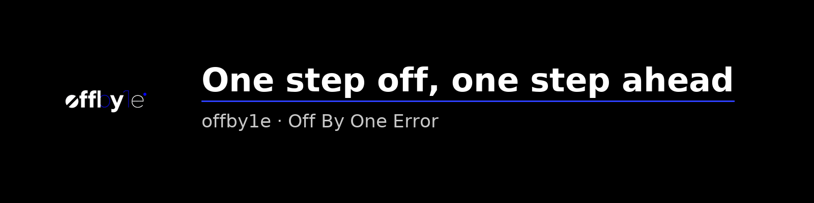

  

# 🕹️ offby1e: The One Difference. A Story of Code, Creativity, and Growth.

👋 **Welcome to `offby1e`**

`offby1e`는 "off by one error"에서 영감을 받은 브랜드입니다. 코드에서 발생하는 사소한 실수가 때로는 예상치 못한 결과로 이어지듯, 우리는 이 작은 차이가 혁신의 열쇠가 된다고 믿습니다. 저희의 미션은 오류에 대한 인식을 실패가 아닌, 배움과 창의성, 그리고 새로운 시작의 기회로 바꾸는 것입니다.

> **Our Slogan: One step off, one step ahead.**

---

### 🚀 **About Me**

안녕하세요! 저는 AI와 웹 개발을 주로 다루는 열정적인 소프트웨어 엔지니어입니다. 혁신적인 솔루션을 구축하고 다른 개발자들과 교류하는 것을 즐깁니다. 이 공간은 저의 프로젝트 허브이자, 작은 실수 하나가 위대한 발견으로 이어질 수 있다는 저의 철학을 담고 있습니다.

---

### ✨ **Our Core Philosophy**

저희는 다음 가치를 바탕으로 커뮤니티와 브랜드를 구축해 나갑니다.

* **Embrace the 'Error'** 🐞: 모든 버그를 소중한 교훈으로 여깁니다. `offby1e`는 디버깅과 문제 해결 과정을 즐거움과 성장의 원천으로 삼습니다. 오류를 기꺼이 받아들이는 자세야말로 한 단계 더 나아가는 첫걸음입니다.
* **Code Meets Art** 👩‍💻🖼️: 기술의 기능성과 창의적인 디자인 사이의 간극을 잇습니다. 우리의 프로젝트와 제품은 논리적으로 견고하면서도 심미적으로 아름답도록 제작되어, 코드가 예술의 한 형태임을 증명합니다.
* **Open Exploration** 🗺️: 우리는 끊임없이 탐구합니다. 이 레포지토리는 오픈 소스 프로젝트의 허브이자, 우리의 발견을 공유하고 커뮤니티와 함께 배우고 성장하는 공간이 될 것입니다.

---

### 🛠️ **Current Focus**

- 🔭 **현재 개발 중:** [**Playground.O : My Portfolio Web**](https://github.com/offby1e/offby1e_Server)
- 🌱 **새롭게 학습 중:** **Web Development (JS, Node.js)** & **OOP**

---

### 🤝 **Past Projects & Collaboration**

- 👯 **Geekble**과 함께 🔗 [**Glaisser**](https://github.com/offby1e/Glaisser) 프로젝트 참여
- 🤖 데니스 홍 교수님의 <RoMeLa와 함께하는 "동행 로봇 발명 워크숍"> 프로젝트 🔗 [**Fire CANNON**](https://github.com/offby1e/Fire-CANON) 개발 참여
- 🎥 KBS <[**스카우트 4.0**](https://program.kbs.co.kr/1tv/culture/ajobter/pc/index.html)> 방영작 🔗 [**AI-VIWAD**](https://github.com/offby1e/AI-VIWAD) 개발

---

### ✨ **Key Contributions & Awards**

- **2023 Geekble Project**
- **LG-CNS AI Genius Academy: SSCAS** 🥇
- **KCF-2023: Phami AI-Speech Recognition Service**
- **2023 Mist Campus Competition: DiSRHiT (AI-Hand)** 🥇

---

### 🫧 **Socials**

 

---

### ⚡ **Tech Stack**

            

---

### 📊 **GitHub Stats**

 
 

---

### 🏆 **GitHub Trophies**

---

### 🔝 **Top Contributed Repo**

---

